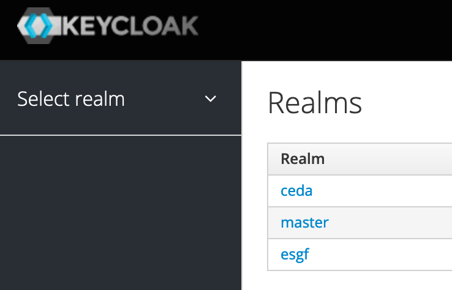
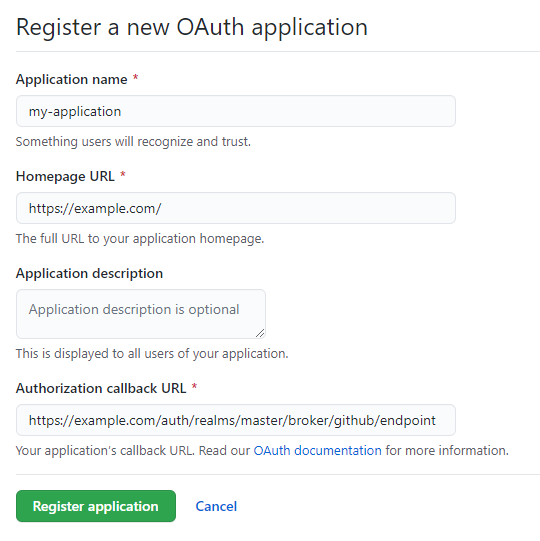
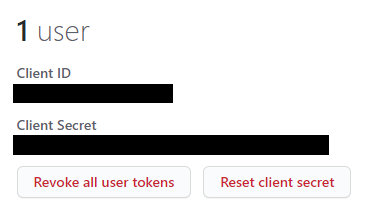
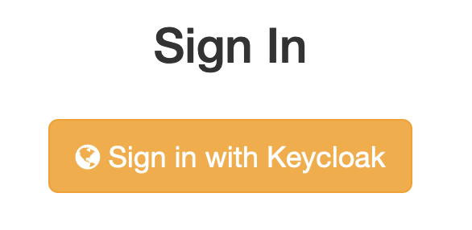
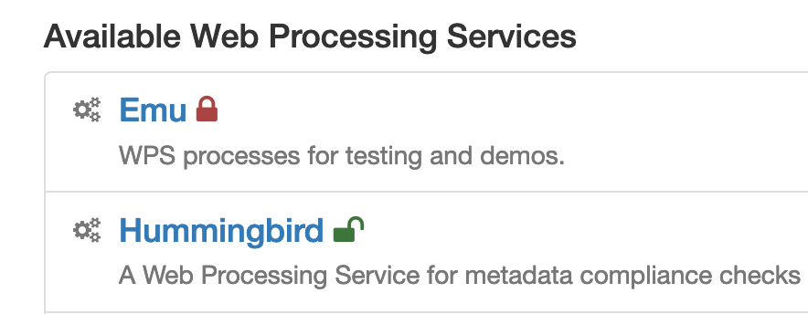
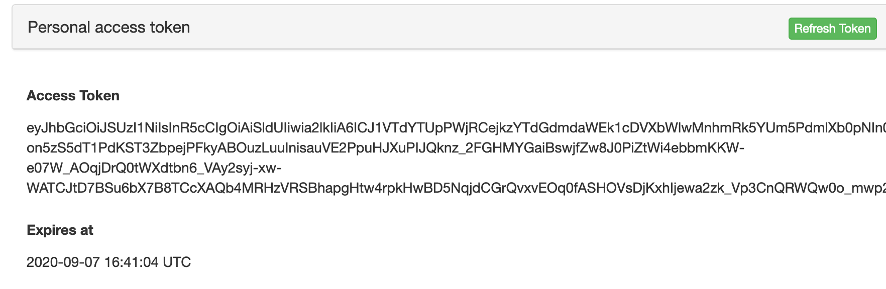
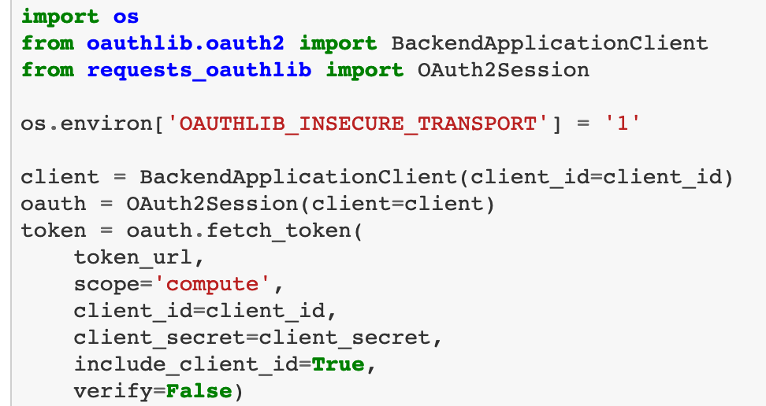
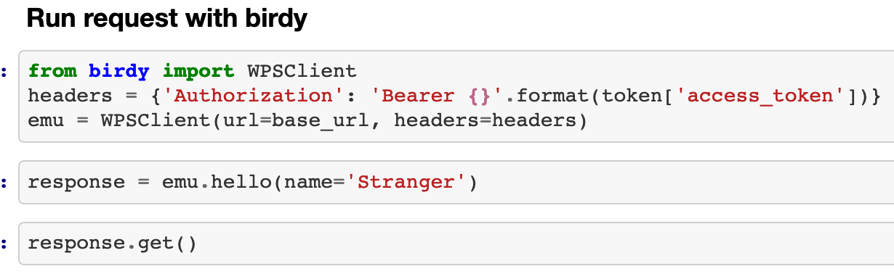

## OAuth 2.0 with Keycloak

Use Keycloak as Identity Provider

TGIF, DKRZ, 11 September 2020


---
## OAuth 2.0
* OAuth 2.0 is the modern standard for securing access to APIs.
* Used by Google, GitHub, etc
* First draft spec in 2010.
* A "framework" not a "protocol".
* Still unfinished ... but most implementations very similar.
* https://www.oauth.com/
```note
core document was renamed from being a “protocol” to being a “framework,”

In 2012, Eran Hammer, the primary editor of the OAuth 2.0 standard, decided he could no longer contribute to the standard and officially withdrew his name and left the working group.

“I’m hoping someone will take 2.0 and produce a 10 page profile that’s useful for the vast majority of web providers.”

Today, if someone wants to implement OAuth 2.0 for their web service, they need to synthesize information from a number of different RFCs and drafts.

Interestingly, most of the web services that do implement OAuth 2.0 for their APIs come to many of the same decisions, and so most of the OAuth 2.0 APIs in existence look very similar.
```
---
## Keycloak

* Open Source Identity and Access Management
* Identity Provider - IDP
* Manage users and login to Portals.
* Protect resources: downloading in ESGF, access to processing.
* Supports OAuth2.
* https://www.keycloak.org/
---
## Keycloak: ESGF Realm

realm manages a set of users, credentials, roles, and groups
```note
Taken from:
https://github.com/watucker/esgf.github.io/blob/idp-user-accounts/idp-registration.md

- **Relying Party (RP):**
  An OAuth 2.0 Client application that requires user authentication and claims from an Identity Provider. Relying Parties must register themselves with an Identity Provider to allow this interaction.
- **Identity Provider (IDP)**
  This is a trusted source of authority on user identity which communicates with a Relying Party using the OAuth 2.0 protocol.
- **Keycloak:**
  Keycloak is an identity management server written in Java. Its documentation can be found **here**.
- **Local IDP:**
  This is a Keycloak server installed on a node at an ESGF site and acting as an Identity Provider. It would be appropriately branded and provide login and registration for users at that site.
- **IDP Proxy:**
  This is a Keycloak server acting as the central identity management service for ESGF. While it facilitates login for ESGF users, it does not allow registration. Instead acting as proxy to multiple Local IDPs (hence "IDP Proxy") which provide it with user identities. This gives it access to all users in the federation, allowing it to be the Identity Provider for all ESGF applications.
- **Commercial IDP:**
  An Identity Provider not managed by ESGF but which could be hooked up to the IDP Proxy to provide additional login options for "homeless" users. e.g. GitHub, Google Plus, etc.
- **ESGF Application:**
  An application, typically a web application (e.g. COG), which may utilise user account information provided by the OpenID Connect protocol. This would be facilitated by acting as Relying Party to the IDP Proxy using some kind of OpenID Connect authentication library.
- **IDP Administrator:**
  A person with access to the administration backend of an Identity Provider. For example, somebody with access to the admin console of a Keycloak instance. This may also be the owner or an administrator of a GitHub organisation.
- **RP Administrator:**
  A person with access to the administration backend of a Relying Party. This could be the manager of a web application or the administrator of a Keycloak server that is behaving as a Relying Party.
- **Realm:**
  In Keycloak, a realm manages a set of users, credentials, roles, and groups. All interactions with a Keycloak server happen within the context of a realm.
- **Client:**
  In Keycloak, clients are entities that can request Keycloak to authenticate a user. All OAuth 2.0 flows happen via a client configured on an Identity Provider's server.
- **Keycloak API:**
  The Keycloak Admin REST API provides endpoints to manipulate a Keycloak realm. We are using it to automate the process of client registration.
- **Keycloak API User:**
  This is any Keycloak user with authority to use the Keycloak Admin REST API for a given realm.
- **Bearer Token:**
  This is a token included in an HTTP Authorization header that authorizes access to a particular resource or set of resources without the sender needing to prove their identity.
```
---
## Keycloak: Login to ESGF Portal
* Using Keycloak as Identity Provider
* Login to existing ESGF Portals
* Using OpenID-Connect ... OpenID Authentication using OAuth2
```note
**ESGF Application:**
  An application, typically a web application (e.g. COG), which may utilise user account information provided by the OpenID Connect protocol. This would be facilitated by acting as Relying Party to the IDP Proxy using some kind of OpenID Connect authentication library.
```
---
## Register a Client

* Clients (Apps) can request the Identity Provider to authenticate a user
* Relying Party (RP)
---
## Client Details

---
## User Registration
* Users are registered in Keycloak
* Username, Password, ...
* Multiple IDPs possible ... Sign-in with GitHub at ESGF IDP Proxy.
```note
https://github.com/watucker/esgf.github.io/blob/idp-user-accounts/idp_user_accounts.md
```
---
## Sign-in to a Portal
https://demo-phoenix.cloud.dkrz.de/

Using redirection-based flow
```note
https://github.com/oauthlib/oauthlib

A client utilizing the authorization code grant workflow.

A web application is a confidential client running on a web server. Resource owners access the client via an HTML user interface rendered in a user-agent on the device used by the resource owner. The client credentials as well as any access token issued to the client are stored on the web server and are not exposed to or accessible by the resource owner.

The authorization code grant type is used to obtain both access tokens and refresh tokens and is optimized for confidential clients. As a redirection-based flow, the client must be capable of interacting with the resource owner’s user-agent (typically a web browser) and capable of receiving incoming requests (via redirection) from the authorization server.
```
---
## Protect a Resource Server
Web Processing Service with token based access

```note
https://www.oauth.com/oauth2-servers/the-resource-server/

The resource server is the OAuth 2.0 term for your API server. The resource server handles authenticated requests after the application has obtained an access token.
```
---
## Use an Access Token

Use a string token valid for a short time.
```note
https://www.oauth.com/oauth2-servers/making-authenticated-requests/

**Bearer Token:**
  This is a token included in an HTTP Authorization header that authorizes access to a particular resource or set of resources without the sender needing to prove their identity.
```
---
## JSON Web Tokens
* securely transmitting information between parties as a JSON.
* can be verified and trusted because it is digitally signed.
https://jwt.io/
---
## Get a Token without redirect

From terminal or Jupyter notebook
```note
https://twitcher.readthedocs.io/en/latest/notebooks/twitcher-keycloak-demo.html

A public client utilizing the client credentials grant workflow.

The client can request an access token using only its client credentials (or other supported means of authentication) when the client is requesting access to the protected resources under its control, or those of another resource owner which has been previously arranged with the authorization server (the method of which is beyond the scope of this specification).

The client credentials grant type MUST only be used by confidential clients.

Since the client authentication is used as the authorization grant, no additional authorization request is needed.
```
---
## Use Bearer Token to access Resource
Add token in header variable "Bearer" to access resource

```note
https://github.com/bird-house/twitcher/blob/master/notebooks/twitcher-keycloak-online-demo.ipynb
```
---
